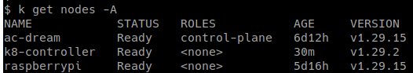
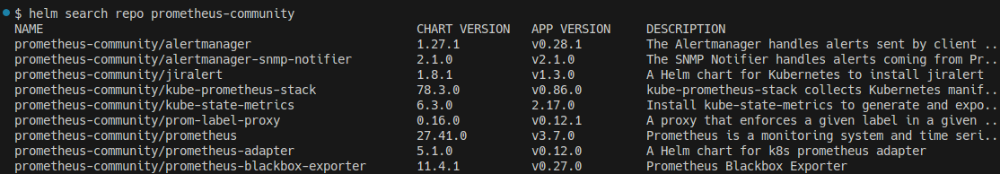
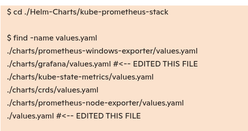
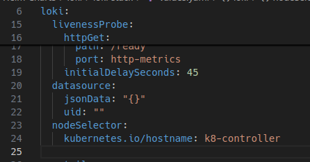
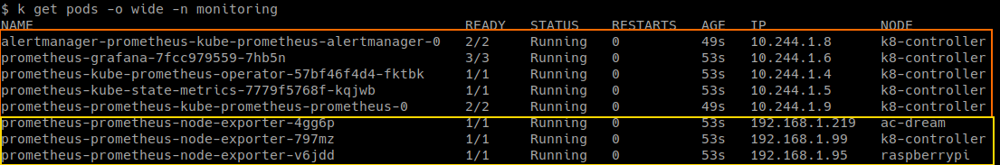

### INSTALL GRAFANA, LOKI, PROMETHEUS ON UBUNTU WORKERS ONLY (NOT RASPBERRY PI)

SETUP:

To install Grafana, Prometheus, and Loki on your Kubernetes cluster — specifically targeting the k8-controller node (ubuntu worker) while still monitoring the raspberrypi — you’ll want to use node selectors or taints/tolerations to control pod placement, and Prometheus node exporters or agents to collect metrics from all nodes.

Here’s a step-by-step breakdown:

🛠️ 1. Use Helm to Install the Monitoring Stack
You'll likely use the kube-prometheus-stack Helm chart, which bundles Prometheus, Grafana, and Alertmanager. Loki can be added separately or via the Grafana Helm chart.

bash

    helm repo add prometheus-community https://prometheus-community.github.io/helm-charts
    helm repo add grafana https://grafana.github.io/helm-charts
    helm repo update

    helm repo ls

    NAME                	URL                                               
    grafana             	https://grafana.github.io/helm-charts
    prometheus-community	https://prometheus-community.github.io/helm-charts

Let's save the Helm charts locally so we can update them and save them in our git repo

1. Grafana

    helm pull grafana --repo https://grafana.github.io/helm-charts --untar

2. Prometheus

This will fail:

    helm pull prometheus-community --repo https://prometheus-community.github.io/helm-charts --untar

    Error: chart "prometheus-community" not found in https://prometheus-community.github.io/helm-charts repository

 

🔍 What's happening?  

- __prometheus-community__ is the repository name, __not__ the chart name.

- You need to specify the chart name within that repo — for example: __kube-prometheus-stack__.

 
To list charts available in a repo: 

    helm search repo prometheus-community

    helm pull prometheus-community/kube-prometheus-stack --untar

...

📍 2. Pin Grafana, Prometheus, and Loki to k8-controller

Use node selectors or affinity rules in your Helm values to ensure these pods run only on k8-controller.

Example snippet for Helm values:

yaml

    # prometheus/Helm-Charts/kube-prometheus-stack/values.yaml
    prometheus:
    prometheusSpec:
        nodeSelector:
        kubernetes.io/hostname: k8-controller

    # prometheus/Helm-Charts/kube-prometheus-stack/charts/grafana/values.yaml
    grafana:
    nodeSelector:
        kubernetes.io/hostname: k8-controller

    # prometheus/Helm-Charts/loki/loki-stack/values.yaml
    loki:
    nodeSelector:
        kubernetes.io/hostname: k8-controller

To add the snippet above:

    cd /home/angelcruz/repos/home_lab_k8/prometheus/Helm-Charts/kube-prometheus-stack

    ls
    Chart.lock  charts  Chart.yaml  README.md  templates  values.yaml

Edit the values.yaml file there.

For Loki:

    mkdir loki
    helm pull grafana/loki-stack --untar

Edit the values file:  

/home/angelcruz/repos/prometheus-grafana/Helm-Charts/loki/loki-stack/values.yaml

__HELM INSTALL__

workspace: 

    /home/angelcruz/repos/prometheus-grafana/Helm-Charts/Helm-Charts/kube-prometheus-stack

helm install: 

    helm uninstall prometheus . --namespace monitoring

Check the Pods and validate NodeSelector worked (promethues and grafana only on ubutnu worker) 

- Prometheus, Grafana, Alertmanager, and Kube State Metrics are all running on k8-controller — exactly as intended.

- Node Exporters are running on all three nodes (ac-dream, k8-controller, and raspberrypi), giving you full cluster visibility.

- No pods are evicted or pending — which means your disk pressure issue is resolved and your nodeSelector edits are working.

 

You can also use affinity for more flexible placement, or taints/tolerations if you want to isolate raspberrypi.
    -- sh

But if they were minimal containers (like Prometheus, Grafana, or exporters), they likely lacked those tools — making the debug pod a smart move.

__DNS FAILING__

While inside a debug pod:

    root@curlpod:/ ]$ curl http://loki.monitoring.svc.cluster.local:3100/ready

    curl: (6) Couldn't resolve host 'loki.monitoring.svc.cluster.local'

DNS resolution inside the pod failed, which means the service name loki.monitoring.svc.cluster.local isn’t resolving.

__LOKI INSTALLATION PROCESS __

path:  
/home/angelcruz/repos/home_lab_k8/prometheus/Helm-Charts/loki/loki-stack 

edit values.yaml 

    promtail:
      tolerations:
        - key: "dedicated"
          operator: "Equal"
          value: "pi"
          effect: "NoSchedule"
      enabled: true
      config:
        logLevel: info
        serverPort: 3101
        clients:
          - url: http://{{ .Release.Name }}:3100/loki/api/v1/push
__TAINT__

we do a 'taint' with kubectl:

    kubectl taint nodes raspberrypi dedicated=pi:NoSchedule

__To see which nodes have taints__

    kubectl get nodes -o json | jq '.items[] | {name: .metadata.name, taints: .spec.taints}'

    {
      "name": "ac-dream",
      "taints": null
    }
    {
      "name": "k8-controller",
      "taints": null
    }
    {
      "name": "raspberrypi",
      "taints": [
        {
          "effect": "NoSchedule",
          "key": "dedicated",
          "value": "pi"
        }
      ]
    }

__Helm install Loki__

    helm install loki . --namespace monitoring

    NAME: loki
    LAST DEPLOYED: Thu Oct 16 11:16:27 2025
    NAMESPACE: monitoring
    STATUS: deployed
    REVISION: 1
    NOTES:
    The Loki stack has been deployed to your cluster. Loki can now be added as a datasource in Grafana.

    See http://docs.grafana.org/features/datasources/loki/ for more detail.

 

---

📡 3. Monitor Raspberry Pi Node
Even though you don’t want to run heavy services on raspberrypi, you can still monitor it:

Prometheus Node Exporter: Runs as a lightweight DaemonSet on all nodes to expose metrics.

Grafana Agent or Alloy: Can be deployed on raspberrypi to forward logs and metrics to Loki and Prometheus.

These agents are lightweight and designed for resource-constrained environments.

📦 4. Install Loki and Configure Log Collection
Install Loki via Helm:

bash
helm install loki grafana/loki-stack --namespace monitoring
Use Grafana Agent or Promtail on raspberrypi to forward logs to Loki. You can configure Promtail with a nodeSelector to run only on the Pi.

📊 5. Visualize in Grafana
Grafana will connect to Prometheus and Loki as data sources. You can create dashboards to visualize:

CPU, memory, disk usage from Prometheus

Logs from Loki

Node-specific metrics (including Raspberry Pi)

---

### ✅ How to monitor your own applications
To have Prometheus scrape metrics from your custom apps (e.g., Flask, Spring Boot, Node.js), you need to:

1. 📎 Expose a /metrics endpoint
Your app should expose Prometheus-compatible metrics at an HTTP endpoint like /metrics.

You can use libraries like:

Python: prometheus_client

Node.js: prom-client

Java: Micrometer or Dropwizard

2. 🏷️ Annotate your Kubernetes Service
Prometheus uses service annotations to discover targets. Example:

yaml
apiVersion: v1
kind: Service
metadata:
  name: my-app
  annotations:
    prometheus.io/scrape: "true"
    prometheus.io/path: "/metrics"
    prometheus.io/port: "8080"
spec:
  selector:
    app: my-app
  ports:
    - name: http
      port: 8080
This tells Prometheus to scrape http://<pod-ip>:8080/metrics.

3. 🧠 Optional: Use ServiceMonitor or PodMonitor
If you're using the full kube-prometheus-stack, you can define a ServiceMonitor CRD instead of relying on annotations:

yaml
apiVersion: monitoring.coreos.com/v1
kind: ServiceMonitor
metadata:
  name: my-app-monitor
  labels:
    release: prometheus
spec:
  selector:
    matchLabels:
      app: my-app
  endpoints:
    - port: http
      path: /metrics
      interval: 30s
This gives you more control and integrates cleanly with the Prometheus Operator.

🧪 Want to test it?
You can deploy a simple app with a /metrics endpoint and see if Prometheus picks it up. I can help you scaffold that in Python or Node.js if you'd like.

Would you like a working example of a ServiceMonitor and a sample app that exposes metrics?