Docker build:

    cd app

    # Enable QEMU emulation (if not already done):
    docker run --rm --privileged multiarch/qemu-user-static --reset -p yes

    # create a builder named mybuilder
    docker buildx ls
    docker buildx rm mybuilder # if it exists

    docker buildx create --name mybuilder --use
    docker buildx inspect mybuilder --bootstrap
    # That output above confirms your mybuilder instance is fully 
    # operational and ready for cross-platform builds — including 
    # linux/arm64, which is exactly what your Raspberry Pi needs ✅.

    # Rebuild and push the image for ARM64
    docker buildx build --platform linux/arm64 \
    -t mrangelcruz1960/python-logger:latest \
    --push .
    # This will:
    # Build for ARM64 (Raspberry Pi)
    # Push directly to Docker Hub
    # Avoid local execution errors due to architecture mismatch

Inspect the image:

    docker image inspect mrangelcruz1960/python-logger:latest| grep Architecture
    # Archtecture should be arm64 for a raspberry pi


Deploy:

    kubectl apply -f deployment.yaml


--- 
ACCESSING THE MONITORS

    kubectl port-forward -n monitoring svc/prometheus-grafana 3000:80

    kubectl port-forward -n monitoring svc/prometheus-kube-prometheus-prometheus 9090:9090

    kubectl port-forward -n monitoring svc/loki 3100:3100


__IF PORT FORWARD IS FAILING__

    udo ufw allow 10250/tcp
    Rule added
    Rule added (v6)


    sudo ufw status
    Status: active

    To                         Action      From
    --                         ------      ----
    22                         ALLOW       Anywhere                  
    21114:21119/tcp            ALLOW       Anywhere                  
    21116/udp                  ALLOW       Anywhere                  
    10250/tcp                  ALLOW       Anywhere                  
    22 (v6)                    ALLOW       Anywhere (v6)             
    21114:21119/tcp (v6)       ALLOW       Anywhere (v6)             
    21116/udp (v6)             ALLOW       Anywhere (v6)             
    10250/tcp (v6)             ALLOW       Anywhere (v6)             


---

# grafana-for-python-app
Setting up Grafana dashboards that monitor web application created in Python. App is hosted on docker containers

# Grafana Monitoring for Python Application

This project sets up Grafana to monitor the performance and metrics of a Python application. By integrating Grafana with Prometheus and a Python monitoring library (like `prometheus_client`), you can visualize and track various metrics, such as request count, response time, memory usage, and more.

## Table of Contents

- [Prerequisites](#prerequisites)
- [Setup Instructions](#setup-instructions)
- [Metrics Exposed](#metrics-exposed)
- [Grafana Dashboard](#grafana-dashboard)
- [Running the Application](#running-the-application)
- [Configuration](#configuration)
- [Loki - Log aggregation](#loki)
- [Troubleshooting](#troubleshooting)
- [License](#license)

## Prerequisites

Before you begin, ensure that you have the following installed:

- [Python 3.x](https://www.python.org/downloads/)
- [Docker](https://www.docker.com/get-started)
- [Docker Compose](https://docs.docker.com/compose/)
- [Grafana](https://grafana.com/grafana/download)
- [Prometheus](https://prometheus.io/docs/prometheus/latest/installation/)

### Python Dependencies

You'll need the following Python libraries:

```python
#import those libs to your application
from prometheus_client import Counter, generate_latest, make_wsgi_app
from prometheus_client.exposition import basic_auth_handler

# In terminal run this command
 pip install prometheus_client
```

### Grafana

```bash
apt-install grafana-server
```

## Running the App

To communicate with prometheus we need API route to provide a way to send out metrics to client. 
This route setting creates /metrics page that will count requests number for specific endpoints

Declaration of variables that counts page views

```python
# Create a metric to track requests
REQUEST_COUNT = Counter('flask_requests_total', 'Total number of requests')
PAGE_VIEWS = Counter("flask_page_views", "Count of page views", ["endpoint"])
```

And metrics for specific endpoints

```python
@app.route('/metrics')
def metrics():
    # Increment the request counter for each request to the app
    REQUEST_COUNT.inc()
    return generate_latest()

@app.route('/login')
def login():
    PAGE_VIEWS.labels(endpoint="home").inc()

@app.route('/dashboard')
def dashboard():
    PAGE_VIEWS.labels(endpoint="dashboard").inc()
```

and this line that allows the communicate process to run..

```python
if __name__ == "__main__":
    # Expose the Prometheus metrics as a WSGI app
    app.wsgi_app = make_wsgi_app()
```

There is various of metrics that we are able to track via this library. Some of them listed below.
Detailed informations in official docs - https://prometheus.github.io/client_python/instrumenting/

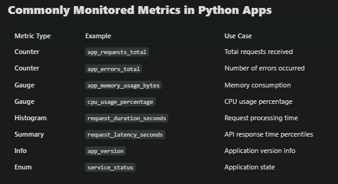

## Configuration 

You need access port 9090 for prometheus api actions, if its disable use following command:

```bash
sudo ufw enable 9090/tcp
```

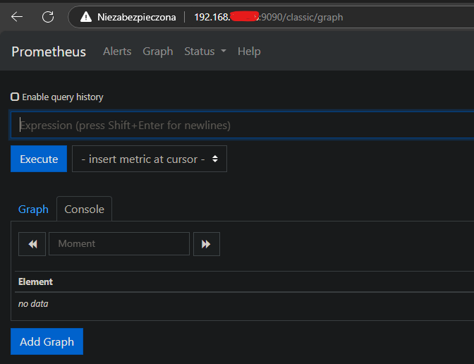


### Prometheus config

By default its placed under /etc/prometheus/prometheus.yaml, to start monitoring the app endpoint you need add following lines

```yaml
global:
  scrape_interval: 5s  # How often Prometheus scrapes data

scrape_configs:
  - job_name: flask_app
    static_configs:
      - targets: ["IP_ADDRES/HOSTNAME:5000"]
```


### Grafana config

Grafana interface is available on http://localhost:3000. Login and password is admin. Go to settings->data source->prometheus

Set your servername:9090 where you are host the app. If you do it locally its http://localhost:9090.
All metrics that are gathered are available under http://SERVER_NAME:PORT/metrics for example http://localhost:8080/metrics

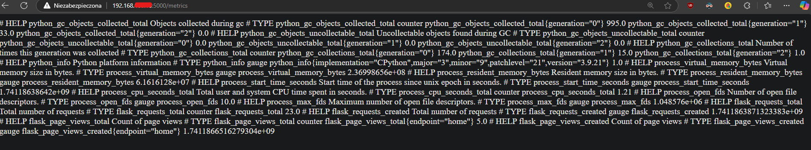

### Dashboard - app usage

To track number of page's views go query : flask_page_views_total

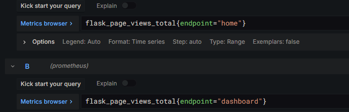


It looks like this - one colour for one endpoint views line

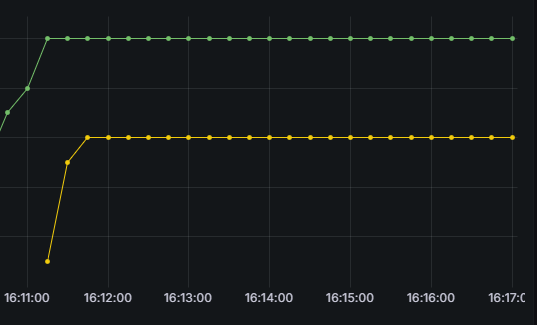


### Dashboard - server usage

To gather information about resource usage we need different queries. Fortunatelly we dont need to configure anything because prometheus stores basic resource stats by default.
Then lets create a dashboard.

```pomQL
#for CPU
100 - (avg by(instance) (rate(node_cpu_seconds_total{mode="idle"}[5m])) * 100)

#for RAM
100 * (1 - (node_memory_MemAvailable_bytes / node_memory_MemTotal_bytes))
```

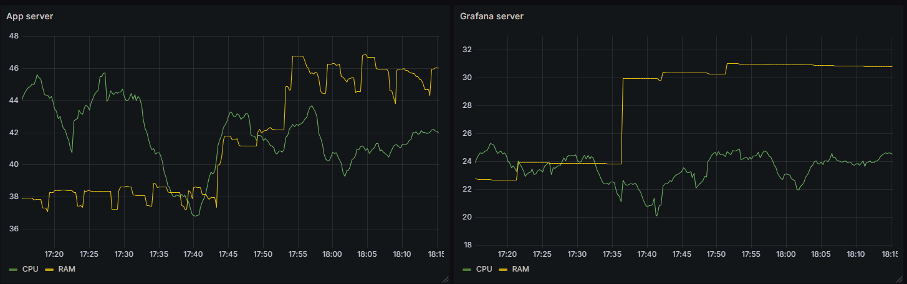

If your environment requires additional metrics check documentation of **client_python** library, there is huge number of various metrics
that may improve your monitoring overall usability. For example :

- disk usage

```promql
node_filesystem_free_bytes / node_filesystem_size_bytes * 100
```

  
- network usage

```promql
rate(node_network_receive_bytes_total[5m])
```


## Loki

Loki is a log aggregation system developed by Grafana Labs, designed to efficiently collect, store, and query logs. Unlike traditional log systems, Loki only indexes metadata (labels), making it cost-effective and scalable. It works seamlessly with Promtail (log shipper) and Grafana, allowing you to correlate logs with metrics using a unified interface. Loki & Prometheus connected each other create a full stack log system, he is a breakdown

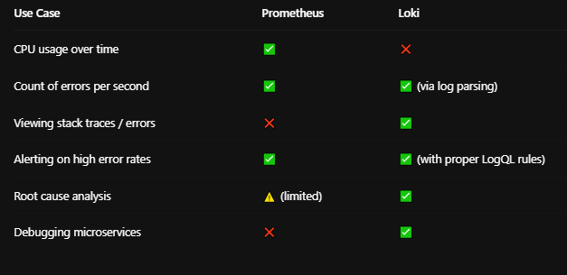


### Startup Settings

Except of Grafana we need Loki server and client which is named promtail, definition of containers below:

```yaml
services:
  loki:
    image: grafana/loki:2.9.0
    ports:
      - "3100:3100"
    command: -config.file=/etc/loki/local-config.yaml

  promtail:
    image: grafana/promtail:2.9.0
    volumes:
      - /var/log:/var/log
      - /etc/machine-id:/etc/machine-id
      - ./promtail-config.yaml:/etc/promtail/config.yaml
    command: -config.file=/etc/promtail/config.yaml


```

Here we got config, that in this example will gather logs from /var/log directory

```yaml
server:
  http_listen_port: 9080
  grpc_listen_port: 0

positions:
  filename: /tmp/positions.yaml

clients:
  - url: http://loki:3100/loki/api/v1/push

scrape_configs:
  - job_name: system
    static_configs:
      - targets:
          - localhost
        labels:
          job: varlogs
          __path__: /var/log/*log
```

### DataSource connection

Enter your Grafana frontend then go to datasource option. To establish connection with loki you need provide endpoint url. In our config(docker-compose) all containers within one network comunicates so we are able to use service names.
 **http://loki:3100**

 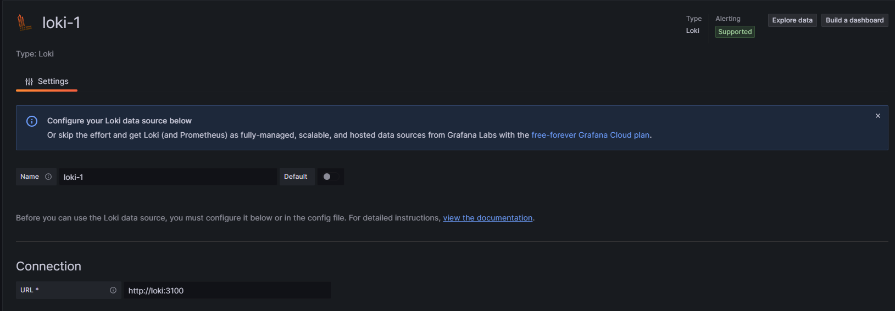

 ### System logs

 Lets visualize system logs gathered from /var/log directory. Promtail is the agent that have config of everything we are monitoring. WARNING : Promtail container must have folder mapped as volume to read logs from machnie folders.
 Quick reminder:

 ```yaml
promtail:
    image: grafana/promtail:2.9.0
    volumes:
      - /root/flask-app/CICD-Docker-for-python-webapp/logs:/var/log/flask
      - /var/log:/var/log
      - /etc/machine-id:/etc/machine-id
      - ./promtail-config.yaml:/etc/promtail/config.yaml
    command: -config.file=/etc/promtail/config.yaml
    networks:
      - monitor
```
**We monitor /var/log local machine folder and map it as /var/log/ inside promtail container**

 ```yaml
server:
  http_listen_port: 9080
  grpc_listen_port: 0

positions:
  filename: /tmp/positions.yaml

clients:
  - url: http://loki:3100/loki/api/v1/push

scrape_configs:
  - job_name: system
    static_configs:
      - targets:
          - localhost
        labels:
          job: varlogs
          __path__: /var/log/*log
```

Focus on the last line, we define here a jobs that tracks specific logs. From Grafana side its easy to visualize it

```logql
{job="varlogs"} |= ``
{job="varlogs"} |= "error" ## search errors only 
```
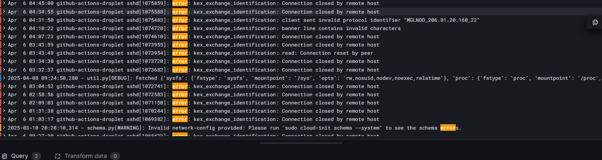


### Application logs

All the apps got various log files systems, so before implementation you need to make sure where exactly its located. By default Python flask app logs sends to stdout and there is no specific file.
We need some modification to make the logs in one specific place. Lets set the location to **/var/log/flask_app.log**
INFO : You dont need to add "logging" import to requirements.txt as its standart python library

```python
import logging

logging.basicConfig(filename='/var/log/flask_app.log',
                    level=logging.INFO,
                    format='%(asctime)s %(levelname)s: %(message)s')

```

We can customize log output by defining functions, for example :

```python
@app.route("/")
def index():
    app.logger.info("🏠 Index route hit")
    return "Hello from Dockerized Flask!"

@app.route("/logtest")
def logtest():
    app.logger.info("🧪 Log test route hit")
    return "Logging works!"
```

Lets connect our python logs with Loki promtail client

```yaml
job: flasklogs
          __path__: /flask-app/CICD-Docker-for-python-webapp/logs/*
```

We must mapp local app folder to promtail container as we did with system logs before
**We monitor CICD-Docker-for-python local application folder and map it as /var/log/flask inside promtail container**

```yaml
volumes:
      - /root/flask-app/CICD-Docker-for-python-webapp/logs:/var/log/flask
```


The final step is to add another job to promtail config file

```yaml
scrape_configs:
  - job_name: system
    static_configs:
      - targets:
          - localhost
        labels:
          job: varlogs
          __path__: /var/log/*log


  - job_name: app
    static_configs:
      - targets:
          - localhost
        labels:
          job: flasklogs
          __path__: /var/log/flask/app.log
```

Then we can play with Grafana charts :). Remember that for application logs job name is different, look carefully on "label" part of yaml file

```logql
{job="flasklogs"} |= ``
{job="vflasklogs"} |= "error" ## search errors only 
```


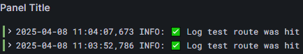

as we see, first logs starts to flow

# ALERTS

    Prometheus  --->  Alertmanager  --->  Notification Channels
        ^                |
        |                +--> Email, Slack, PagerDuty, Webhook, etc.
        |
        +--> Rules file (alerting expressions)

Grafana can also receive alerts directly from Prometheus or define its own rules, but Prometheus + Alertmanager is the canonical setup for system-level alerting.

__⚙️ Step 1 — Deploy Alertmanager (if not yet)__

If you installed Prometheus via Helm, Alertmanager probably already runs inside monitoring.
Check:

    kubectl get pods -n monitoring | grep alert

If you don’t see one, enable it:

    helm upgrade --install prometheus prometheus-community/prometheus \
      -n monitoring \
      --set alertmanager.enabled=true

__🧠 Step 2 — Define Alert Rules__

Create a file (for example alerting-rules.yaml):

    groups:
    - name: system-alerts
      rules:
      # 🔥 Detect OOMKilled pods
      - alert: PodOOMKilled
        expr: kube_pod_container_status_last_terminated_reason{reason="OOMKilled"} == 1
        for: 1m
        labels:
          severity: critical
        annotations:
          summary: "Pod {{ $labels.pod }} in {{ $labels.namespace }} was OOMKilled"
          description: "Container {{ $labels.container }} restarted due to OOM on node {{ $labels.node }}"

      # ⚡ High memory usage for your python-logger
      - alert: PythonLoggerHighMemory
        expr: process_resident_memory_bytes{job="kubernetes-service-endpoints",service="python-logger"} > 120e6
        for: 2m
        labels:
          severity: warning
        annotations:
          summary: "python-logger memory high"
          description: "Resident memory above 120 MB on pod {{ $labels.instance }}"

      # 💀 Prometheus target down
      - alert: TargetDown
        expr: up == 0
        for: 1m
        labels:
          severity: critical
        annotations:
          summary: "Target {{ $labels.instance }} is down"
          description: "Prometheus target {{ $labels.job }} failed to scrape metrics"


Add it to Prometheus config:


    # prometheus.yaml
    rule_files:
      - /etc/prometheus/rules/*.yaml

Mount it as a ConfigMap:

    kubectl create configmap prometheus-rules \
      -n monitoring \
      --from-file=alerting-rules.yaml


and patch your Prometheus deployment (or Helm values) to include that ConfigMap under /etc/prometheus/rules.

__💌 Step 3 — Configure Alertmanager Notifications__

Alertmanager routes alerts to channels.<br>

Example config (alertmanager.yaml):

    route:
      receiver: 'email-team'
      group_wait: 10s
      group_interval: 30s
      repeat_interval: 2h

    receivers:
    - name: 'email-team'
      email_configs:
      - to: 'ops@example.com'
        from: 'alertmanager@example.com'
        smarthost: 'smtp.example.com:587'
        auth_username: 'alertmanager@example.com'
        auth_password: 'password123'

Other options:

- Slack (slack_configs)

- Webhooks (webhook_configs)

- PagerDuty, Opsgenie, etc.


Reload Alertmanager after editing:

    kubectl rollout restart deployment prometheus-alertmanager -n monitoring

__Step 4 — Optional Grafana Alerting (Simpler)__

Grafana has its own alert rules engine (no Alertmanager needed).
Steps:

- Go to Grafana → Alerting → Alert rules

- Click New alert rule

- Choose your Prometheus data source

- Use expression like:

      process_resident_memory_bytes{service="python-logger"} > 120000000

- Set “For” = 1m, severity = critical

- Add notification channel (Slack, email, webhook).


Grafana will handle the evaluation and alert dispatching internally.

__🔬 Step 6 — Useful Alert Ideas for Your Stack__

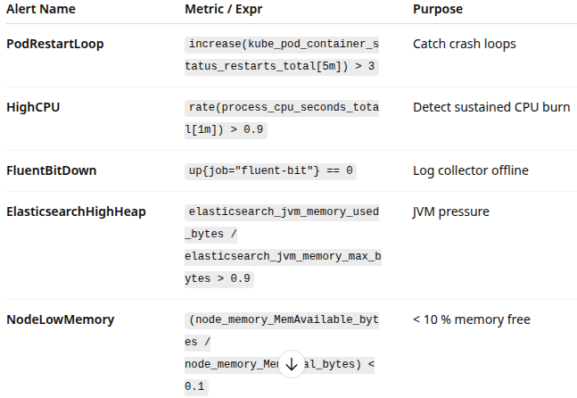

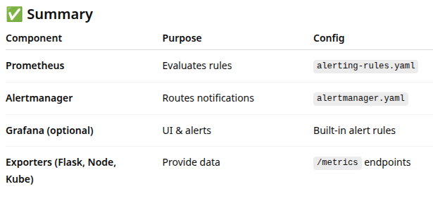

## PROMETHEUS ALERT RULES

    groups:
    - name: system-and-app-alerts
      rules:

      # 🔥  OOM-Killed container
      - alert: PodOOMKilled
        expr: kube_pod_container_status_last_terminated_reason{reason="OOMKilled"} == 1
        for: 1m
        labels:
          severity: critical
        annotations:
          summary: "Pod {{ $labels.pod }} in {{ $labels.namespace }} OOMKilled"
          description: "Container {{ $labels.container }} restarted due to OOM on node {{ $labels.node }}"

      # ⚡  python-logger high memory usage (>120 MB)
      - alert: PythonLoggerHighMemory
        expr: process_resident_memory_bytes{job="kubernetes-service-endpoints",service="python-logger"} > 120e6
        for: 2m
        labels:
          severity: warning
        annotations:
          summary: "python-logger memory high"
          description: "Resident memory above 120 MB on {{ $labels.instance }}"

      # 🔁  Frequent restarts
      - alert: PodCrashLooping
        expr: increase(kube_pod_container_status_restarts_total[5m]) > 3
        for: 1m
        labels:
          severity: warning
        annotations:
          summary: "Pod {{ $labels.pod }} in {{ $labels.namespace }} restarting frequently"
          description: "Container {{ $labels.container }} restarted >3 times in 5 min"

      # 💀  Target not being scraped
      - alert: TargetDown
        expr: up == 0
        for: 1m
        labels:
          severity: critical
        annotations:
          summary: "Target {{ $labels.instance }} down"
          description: "Prometheus failed to scrape {{ $labels.job }} target"

      # 🧠  Node low available memory (<10 %)
      - alert: NodeLowMemory
        expr: (node_memory_MemAvailable_bytes / node_memory_MemTotal_bytes) < 0.10
        for: 2m
        labels:
          severity: critical
        annotations:
          summary: "Low node memory on {{ $labels.instance }}"
          description: "Available memory below 10 % ({{ $value | humanizePercentage }})"

__DEPLOY__

    kubectl create configmap prometheus-rules \
      -n monitoring \
      --from-file=alerting-rules.yaml


Ensure your Prometheus config references:<br>

    rule_files:
      - /etc/prometheus/rules/*.yaml


and mount the ConfigMap there (/etc/prometheus/rules).

Reload

    kubectl rollout restart deployment prometheus-server -n monitoring


__💌 2️⃣ Alertmanager Config → alertmanager.yaml__

    global:
      resolve_timeout: 5m

    route:
      receiver: "default"
      group_by: ["alertname", "job"]
      group_wait: 10s
      group_interval: 30s
      repeat_interval: 2h
      routes:
      - match:
          severity: critical
        receiver: "slack-critical"
      - match:
          severity: warning
        receiver: "email-warnings"

    receivers:
    - name: "default"
      email_configs:
      - to: "ops@example.com"
        from: "alertmanager@example.com"
        smarthost: "smtp.example.com:587"
        auth_username: "alertmanager@example.com"
        auth_password: "your-smtp-password"

    - name: "email-warnings"
      email_configs:
      - to: "devops@example.com"
        from: "alertmanager@example.com"
        smarthost: "smtp.example.com:587"
        auth_username: "alertmanager@example.com"
        auth_password: "your-smtp-password"

    - name: "slack-critical"
      slack_configs:
      - api_url: "https://hooks.slack.com/services/<whatever-your-secs-are>"
        channel: "#cluster-alerts"
        title: "{{ .CommonAnnotations.summary }}"
        text: "{{ .CommonAnnotations.description }}"

__➕ Deploy it__

    kubectl create secret generic alertmanager-config \
      -n monitoring \
      --from-file=alertmanager.yaml

Restart Alertmanager:

    kubectl rollout restart deployment prometheus-alertmanager -n monitoring

__🔍 3️⃣ Verify End-to-End__


    # Check that Prometheus loaded your rules
    http://localhost:9090/alerts

    # View active alerts
    http://localhost:9093/#/alerts

__Trigger tests:__

    # Intentionally stress memory
    curl http://192.168.1.219:30500/stress/mem
    # Or create an OOM by lowering the pod memory limit again

Within ~1 minute you should see:

    ALERTS{alertname="PodOOMKilled",severity="critical"} 1


and a notification in Slack/email.

__📈 4️⃣ Grafana Alerting Alternative (optional)__

You can import the same PromQL expressions as Grafana alert rules:

- Expression: process_resident_memory_bytes{service="python-logger"} > 120e6

- Condition: “for 2 min”

- Channel: Slack/email webhook

Grafana handles the notification internally — simpler for small setups.

__✅ 5️⃣ Summary_

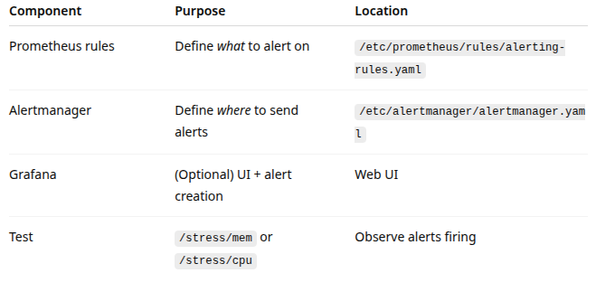

